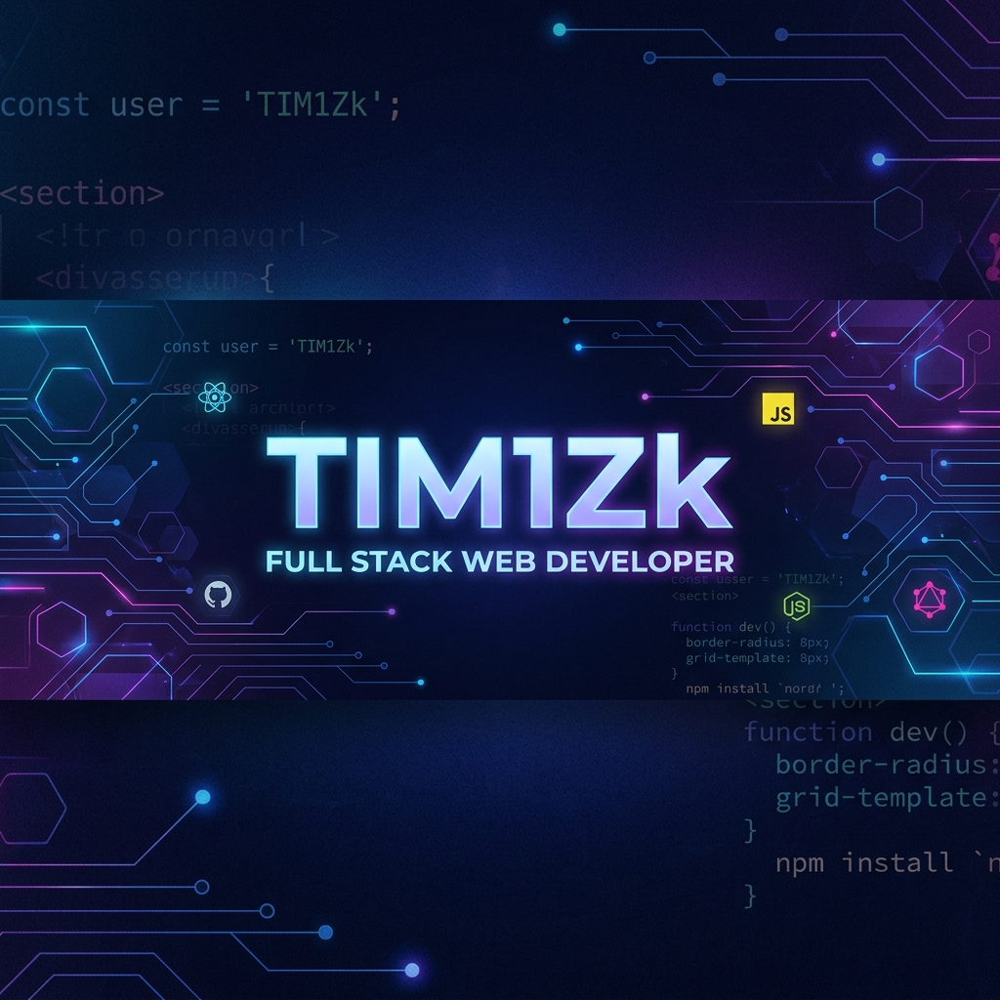

  

# Hi there, I'm Krittawit Bunsop (TIM1Zk) 👋

### 🚀 Full Stack & Mobile Developer
I am a passionate software developer focused on building robust, scalable web and mobile applications. I enjoy solving complex problems and turning ideas into clean, efficient code.

---

### 🛠 Tech Stack

| Category | Tools & Technologies |
| :--- | :--- |
| **Backend** |     |
| **Frontend** |     |
| **Mobile** |   |
| **Databases** |    |

---

### 📂 Featured Projects

- **[Safe Seat](https://github.com/TIM1Zk/Safe-Seat-Project)**
  *A professional Flutter mobile application for secure wallet management and real-time user profile interactions, integrated with Supabase.*
- **[AimZone](https://github.com/TIM1Zk/AimZone)**
  *An e-commerce platform for high-performance computer mice, optimized with Go for high concurrency and speed.*
- **[Vicha](https://github.com/TIM1Zk/Vicha)**
  *A comprehensive E-learning platform designed with Java, focusing on structured course management and student engagement.*

---

### 📊 GitHub Stats

  
  

---

### 📫 Let's Connect!

---

> 📝 Last updated on 2026-05-16.